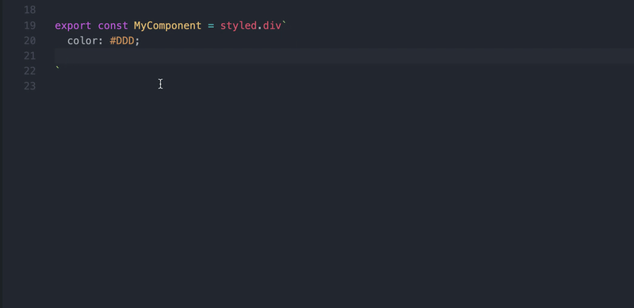
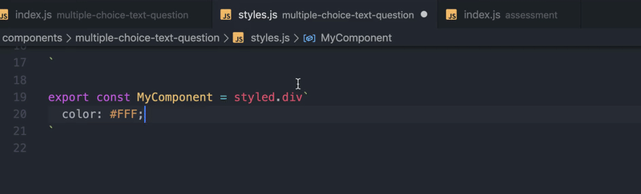

# vscode-lnd-theme
A vscode extension for use with https://github.com/lessondesk/theme

# Features
 - Color highlighting and code suggestions
  

 - Convert Hex/Rgb/Hsl colors to the nearest possible match in the theme
  

# Installation
Download the . Use the overflow menu under extensions in vscode to select "Install from VSIX", and then select the downloaded file.

# Notes
Minimum vscode version: 1.40
